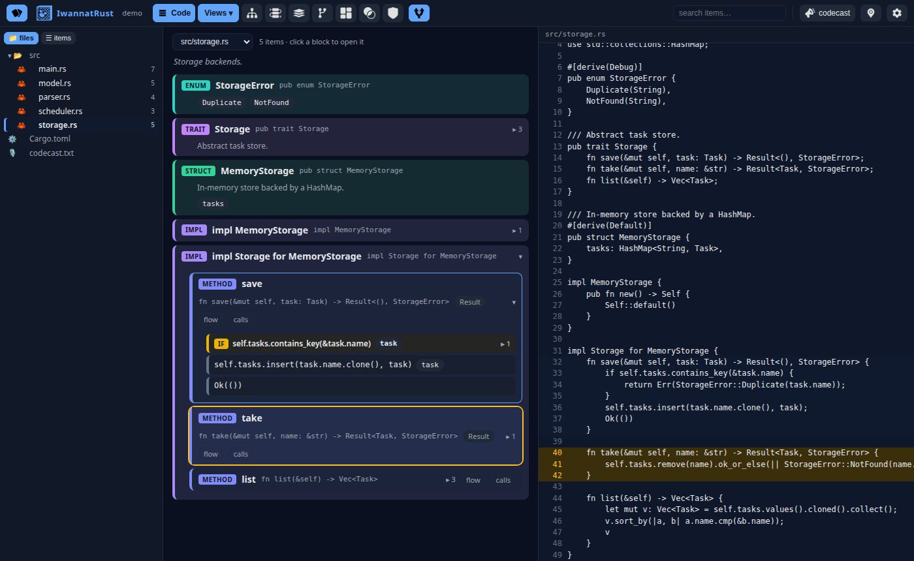
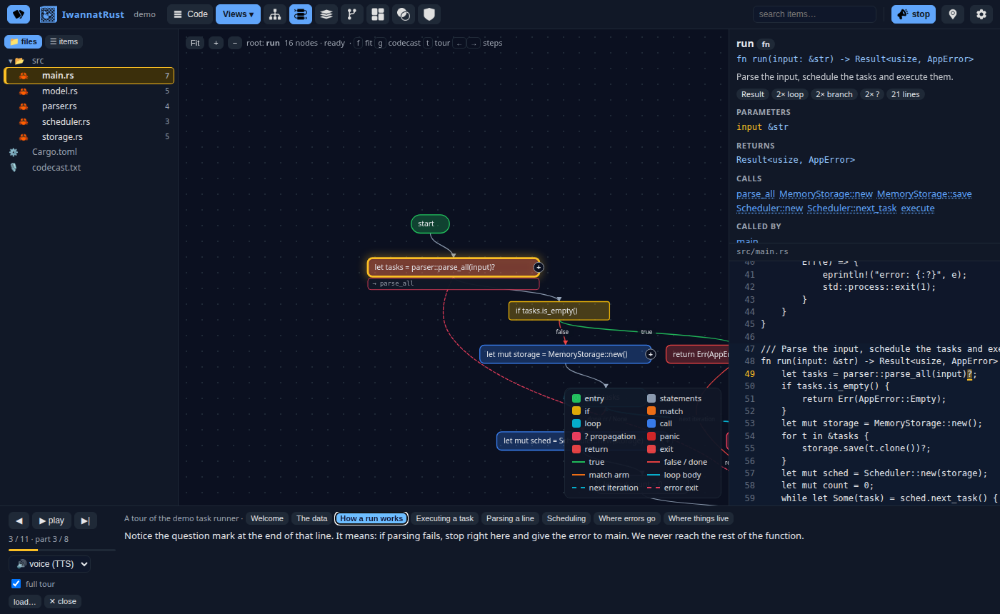
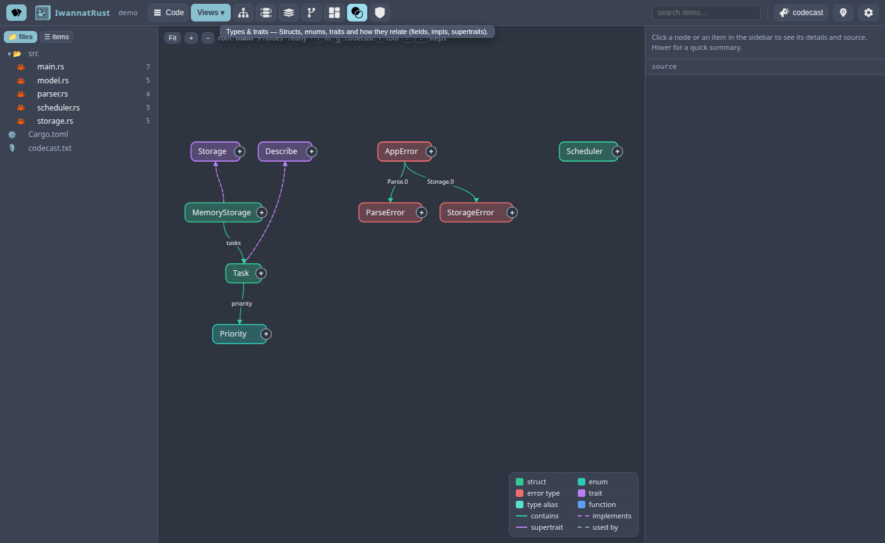
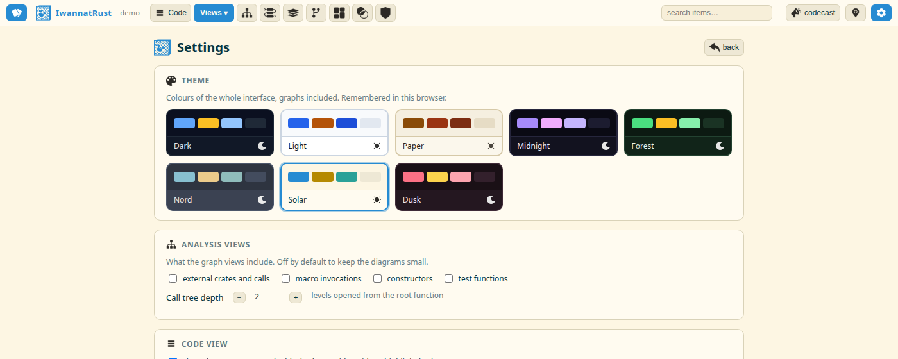

<div align="center">


# IwannatRust

**Make unfamiliar Rust code visually understandable.**

Point it at a crate. Get interactive, colour-coded schematics of how the code works,
and a spoken tour that walks you through it, function by function.

[](https://www.rust-lang.org)
[](https://dioxuslabs.com)
[](#how-it-is-built)
[](LICENSE)

[Quick start](#quick-start) · [What you see](#what-you-see) · [The tour](#the-tour-codecast) · [Views](#analysis-views) · [Docs](docs/README.md)

</div>

---

## Quick start

```sh
rustup target add wasm32-unknown-unknown
cargo install dioxus-cli --version 0.7.10 --locked
scripts/iwr build                     # web UI (dx) + CLI with the UI embedded, one binary
scripts/iwr serve examples/demo       # analyze and open http://127.0.0.1:4321
```

Then press <kbd>t</kbd>. The full tour starts: *"Welcome to demo. It is a tiny task runner with a
parser, a scheduler and a storage backend… Let's start with the big picture."*

```
iwr serve   path/to/project   # interactive UI, live reload on every save
iwr export  path/to/project   # static site (index.html + project.json), embeddable in docs
iwr brief   path/to/project   # compact text brief of the code, for an AI to write a tour
iwr analyze path/to/project   # the raw model as JSON
```

## What you see



**The code as blocks.** Every function, loop, branch, match arm, call, `?`, return or panic is a
coloured block. Nothing is expanded until you click. Variables appear only where they are used,
as chips (`＋name` where introduced, `name` where read); calls to project functions are chips
that jump to the callee. Split the page and the real source follows on the right: hover a block
to light its lines, hover a line to light its block.



**The tour, on top of the graphs.** Each sentence switches to the right view, glows the box it
talks about, highlights the source lines and underlines the exact token. Here: *"Notice the
question mark at the end of that line. It means: if parsing fails, stop right here and give the
error to main."*



**Seven analysis views**, as icons in the top bar (hover one for its name). Types & traits above,
in the Nord theme.



**Eight themes** and every setting on one page (<kbd>,</kbd>): what the graphs include, call-tree
depth, voice and speech rate, reading time, full tour, layout. Everything is remembered.

## The tour (codecast)

📣 *codecast* (<kbd>g</kbd>) opens the player; 📍 *full tour* (<kbd>t</kbd>) plays every part in a row.
With no script, IwannatRust tells its own tour of the project, like a visit:

1. **Welcome**: what the project is for (its crate doc), size, the architecture module by module.
2. **The data**: structs, enums and traits, one by one, with who implements what.
3. **Who calls whom**: the call tree from the entry point.
4. **One part per function**, walked statement by statement in reading order, in plain sentences:
   *"First, the question mark. `parse_all` can fail, and if it does, `run` stops right here and
   hands that error back to its caller… Then a loop: `for t in &tasks`… That is all of `run`.
   Next, let's open `parse_all`, which we just saw it call."*

The camera stays on one function until it is fully explained; the functions it calls come next,
each once. Voice is the browser's speech synthesis, a recording, or silent reading.

**Write your own** (or let an AI do it). A script is plain text: what to say, what to show, what to
glow. No JSON, no API key.

```
## How a run works
@ flow:crate::run
Everything starts in main, which only calls run. So run is where the story is.
! crate::run/b1
= src/main.rs:49:41-41
First, run hands the input to the parser. Notice the question mark: if parsing fails, run stops right here.
! crate::run/b5 crate::run/b6
Then every parsed task is saved into storage, one per loop iteration.
```

```sh
iwr brief examples/demo --guide > brief.txt   # writing guide + the code as text with block ids
iwr check codecast.md --path examples/demo    # every ref must resolve
iwr serve examples/demo --script codecast.md [--audio voice.mp3]
```

Scripts are markdown. One `codecast.md`, or a `codecast/` directory with `index.md` and one file per
part (plus an optional `NN-part.mp3` recording per part); either is picked up automatically next to
the project. [examples/demo/codecast/](examples/demo/codecast/) is a complete eleven-part tour that
also explains the Rust along the way. **Questions** appear under the caption while it plays: the
ones written in the script (`? Why does deploy never run?`) and, whenever a cue says a Rust word,
"What is a crate?", "What does the question mark do?"… from the built-in glossary. Click one: the
tour pauses, answers, and carries on. **Diagrams**: when the code has no picture for an idea, a
part draws its own with a ```` ```mermaid ```` block (GitHub renders it too): `@ diagram` shows it,
`!` glows its nodes, `> copy storage` moves one into a group, `> +copy` reveals one. The demo's
ownership part opens with run, a storage box and a scheduler, and a task copy that changes hands.
Format, refs and player: [docs/codecast.md](docs/codecast.md) · writing guide:
[docs/writing-codecasts.md](docs/writing-codecasts.md).

## Analysis views

| View | What it shows |
|------|---------------|
| **Code** | The file as nested blocks, next to the source. |
| **Call tree** | Who calls whom from the entry point. Edge colour = *how*: in a loop, conditionally, recursively, propagated with `?`, `unwrap`ped. |
| **Control flow** | One function, statement by statement: `if`/`match` branches, loops with back edges, early returns, `?` exits, panics, awaits. |
| **Architecture** | Modules (crates in a workspace), their contents, weighted dependency arcs. |
| **Branch tree** | Every path through a function as a tree; expand a call to inline the callee. |
| **Structure** | Files and modules as columns of blocks, impls and methods nested inside. |
| **Types & traits** | `contains`, `implements`, supertraits, aliases; expand a type to see who uses it. |
| **Error flow** | Fallible functions, error enums, `From` conversions, and whether each call propagates, handles or panics. |

Everywhere: **hover** for signature, doc, parameters, facts, callers and callees; **click** for
details and source; **⊕ / double-click** to expand or open a function's control flow; drag to pan,
wheel to zoom, <kbd>f</kbd> to fit. Click a module in the sidebar to scope the big views to it.

## How it is built

Everything is Rust. The analyzer (`syn`), the layout engine (Sugiyama-style layered layout and
tidy trees, written here), the tour generator and the web UI (Dioxus → WebAssembly) ship in one
self-contained binary. No JavaScript dependencies, no runtime services.

```
crates/iwr-core   analysis → model → views + layout → tour       (no UI deps, compiles to wasm)
crates/iwr-ui     Dioxus 0.7 web app                              (compiled by `dx`)
crates/iwr        CLI: axum server, embedded UI, file watcher, static export
examples/demo     a small task runner that exercises everything
```

`iwr-core` is reusable on its own, in a build script, a docs plugin or the browser:

```rust
let project = iwr_core::analyze_path(Path::new("."))?;
let graph   = iwr_core::views::build(&project, Mode::CallTree, &ViewOptions::default());
let steps   = iwr_core::guide::build(&project, None, &GuideOptions::default());
```

Analysis is syntactic, no type checker: fast on any crate that parses, and right most of the
time. Calls are resolved by name with heuristics (same module first, `self.` methods to the owner
type, generic bounds and field types as hints, trait declarations when the receiver is `T: Trait`).

**Embedding.** `iwr export -o site/` writes a static folder that works from any host or sub-path;
drop it in an `<iframe>` next to your docs. See [docs/embedding.md](docs/embedding.md).

## Documentation

[docs/](docs/README.md): [user guide](docs/user-guide.md) · [CLI](docs/cli.md) ·
[codecast format](docs/codecast.md) · [writing a tour](docs/writing-codecasts.md) ·
[architecture](docs/architecture.md) · [model](docs/model.md) · [development](docs/development.md)

`scripts/iwr` with no argument lists everything: build, serve, codecast, export, brief, guide,
check, summary, test, shot, clean.

## License

MIT
