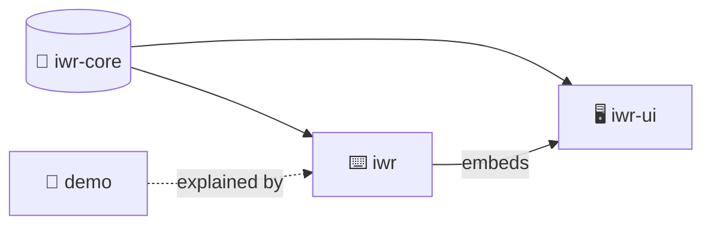

## Welcome

@ diagram
Welcome to IwannatRust, a tool that reads a Rust project and explains it: with pictures, with a voice, and with questions you can click. This is the map: four crates, and who depends on whom.
! core
iwr-core does the thinking. It parses the source, links calls and types, and builds every graph you see. It has no UI at all, and it compiles to WebAssembly so it can run in the browser.
! ui
iwr-ui is the web page: a Dioxus app that draws the graphs as SVG, plays codecasts, and answers questions.
! cli
iwr is the command line: serve, brief, check, export. It analyzes a project, embeds the web UI, and talks to the browser over a small JSON API.
! demo
And demo is a tiny task runner that exists only to be explained. Its codecast is the one the README shows.
? Why three crates and not one?
  Because the browser build and the command line want different things. iwr-core must compile to wasm with no file system and no UI, so it is a pure library. iwr-ui is a web app and pulls in Dioxus. iwr needs tokio, a server and the disk. Keeping them apart keeps each build small and the core honest.
@ plan
Here is the plan: the pipeline from source to picture, the two analysis passes, the model, views and layout, then the codecast format, diagrams, the command line, and finally the player. Click any part to jump there.
