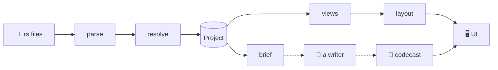

## The pipeline

@ diagram
! src parse resolve project
Before any code, the shape of the whole thing. Source files go through two passes, parse and resolve, and come out as one big value called Project.
! project views layout ui
From the Project, views builds a graph for each picture, layout gives every box a position, and the UI only draws what it is handed.
! project brief writer script
There is a second road. brief prints the Project as compact text, a person or a model writes a codecast from it, and the player performs that script on top of the views.
? Why is the UI kept so dumb?
  Because everything that knows about Rust lives in iwr-core, and iwr-core has to compile without any UI, for wasm. The UI receives finished graphs with coordinates; it never looks at a syntax tree. That is also why the command line can print the same views as text.
@ flow:iwr-core::analyze_sources
! iwr-core::analyze_sources/b1 iwr-core::analyze_sources/b2
In code, the pipeline is two lines. analyze_sources calls parse::collect, then hands the result to resolve::finish. Let's follow each pass.
