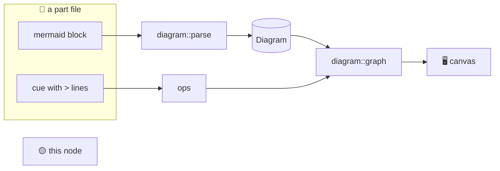

## Diagrams

@ diagram
! part block cue
Sometimes the best explanation is not in the code: a metaphor, a protocol, a physical effect. So a part can draw. This picture is itself one: a mermaid block in the part file, and cues that talk about it.
! block dparse model
The block goes through diagram parse, a small tolerant parser for mermaid flowcharts: shapes, arrows, labels, groups. Lines it cannot read become errors for iwr check, not crashes.
! cue ops dgraph
The greater-than lines of the cues are ops: move a node into a group, show it, hide it. The player replays the ops of a part from its first cue, so stepping back undoes them.
> +token
! token
Like this one, which was hidden until now.
> token canvas
! canvas
And now it moves next to the canvas. diagram graph lays the whole thing out again, and the browser glides the boxes to their new place.
? Why mermaid and not an icon library?
  Because every model already writes mermaid, so the writing guide needs six lines, not a catalogue of icon names to read on every generation. GitHub renders the same block in the markdown. Emoji in labels do the icons, and the shapes give the colours.
@ flow:iwr-core::diagram::graph
! iwr-core::diagram::graph/b6 iwr-core::diagram::graph/b14 iwr-core::diagram::graph/b47
In code, graph starts by computing the state: the parent of every node from the block, then the moves, then what is hidden, in the order the ops were played.
! iwr-core::diagram::graph/b67
= crates/iwr-core/src/diagram.rs:785:18-46
Then place lays out the top level. A group is placed by laying out its members first, recursively, and using the result as the group's size, with the layered engine from the previous part.
! iwr-core::diagram::graph/b97 iwr-core::diagram::graph/b100
Edges inside one level keep the routes the engine computed; edges that cross a group boundary are drawn straight, border to border. The result is a Graph like any other view, so the canvas does not know it is special.
