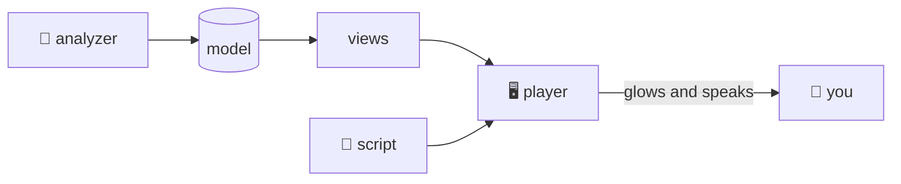

## The player

@ flow:iwr-ui::player::State::apply_cue
On the browser side, every step of a codecast ends in apply_cue. It is short, and it is the whole contract between a script and the screen.
! iwr-ui::player::State::apply_cue/b4 iwr-ui::player::State::apply_cue/b11
First the diagram ops: every greater-than line of the part up to this cue, in order. Replaying from the first cue is what makes stepping backwards correct for free.
! iwr-ui::player::State::apply_cue/b12
Then the cue's three directives go to apply_directives.
@ flow:iwr-ui::player::State::apply_directives
apply_directives is a bigger function with three sections: the view, the highlights, the camera.
! iwr-ui::player::State::apply_directives/b5 iwr-ui::player::State::apply_directives/b8
The at sign is split into a view and a ref. A different view switches the mode, which rebuilds the graph on the next render.
! iwr-ui::player::State::apply_directives/b11 iwr-ui::player::State::apply_directives/b12
A diagram ref picks a block from the current part; any other ref is resolved against the project and becomes the root, the scope, or the open file, depending on the view.
! iwr-ui::player::State::apply_directives/b31 iwr-ui::player::State::apply_directives/b35 iwr-ui::player::State::apply_directives/b36
The bang refs: in a diagram they are node ids and stay as strings; elsewhere they resolve to spans. Resolving by name in a diagram would select a function that happens to share a node's name.
! iwr-ui::player::State::apply_directives/b66 iwr-ui::player::State::apply_directives/b71 iwr-ui::player::State::apply_directives/b82
Last, the camera. The graph is built, the first glowing node is found, and the view is fitted then centred on it, so the listener never has to pan.
? How does the voice know when to go on?
  In TTS mode the browser's speech synthesis fires an end event, and the player calls advance: next cue, or next part when the full tour is on. With a recording, the cue times in the script are matched against the audio position. In reading mode, a timer.
@ diagram
! analyzer model views script player you
And that is the loop: the analyzer builds the model, the views draw it, a script points at it, the player glows and speaks. Everything you saw in this tour was produced by the code it describes, which is either elegant or suspicious, and we will let you decide.
