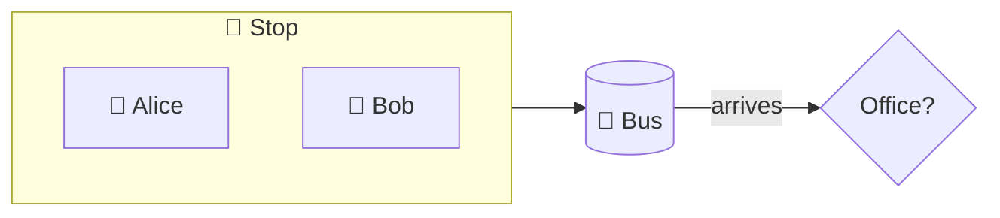

# Codecast

A **script** is spoken text with references to what to show and highlight. The player runs it on top
of the visualizer: switches views, glows the right boxes, highlights and underlines code, and speaks
(browser TTS), plays a recording, or just lets you read. **Questions** appear under the caption
("What is a crate?"); clicking one pauses the codecast, answers, and resumes. Scripts are split into **parts** you can play
independently ("Architecture", "Error handling", …). Any LLM, or a person, can write one from the
**brief**. No API key, no provider, no JSON. Scripts are markdown files: they read fine on GitHub.

```
iwr brief  <path> [--fn P] [--no-body] [--no-overview]   # what the AI reads
iwr guide  <path> [--fn P]  > codecast.md                 # the built-in walkthrough, as a script
iwr check  codecast.md --path <path>                      # every ref must resolve (also: iwr check codecast/)
iwr serve  <path> --script codecast.md [--audio voice.mp3] # play it (also load… in the player bar)
iwr export <path> --script codecast.md [--audio voice.mp3] # bundled in the static site
```

`iwr serve <path>` and `iwr export <path>` pick up a codecast next to the project automatically:
a `codecast/` directory, else `codecast.md`, else the legacy `codecast.txt`.

## Layout: one file or a directory

**One file** (`codecast.md`): the whole script, parts as `##` headings.

**A directory** (`codecast/`), one file per part, so each part can be written, reviewed and recorded alone:

```
codecast/
  index.md            # Title            (+ optional `audio:` for one recording of the whole tour)
                      - [Welcome](01-welcome.md)      optional: the part order as a markdown list
                      - [The data](02-the-data.md)    (unlisted files follow, sorted by name)
  01-welcome.md       ## Welcome  …cues…   (no `##`? the file name becomes the part name: "Welcome")
  01-welcome.mp3      recording of that part, picked up by name (mp3/ogg/wav/m4a/webm)
  02-the-data.md
  glossary.md         optional: the project's own glossary (see Questions); never a part
```

A part file may start with its own `# heading`; after the title in `index.md`, further `#` lines are
ignored. `iwr check codecast/` validates the whole directory;
[examples/demo/codecast/](../examples/demo/codecast/) is one.

## Script format

Line based. One spoken line = one cue. Directive lines above a cue attach to it. Everything is
valid markdown: the title and parts are headings, the directives are short lines.

```
# How the demo task runner works        title (first line)
audio: voice.mp3                         optional recording

## Architecture                          part (play it alone)
@ arch                                   show: <view>[:<ref>]       sticky
The demo is four modules around main.    cue: spoken + shown as caption
! crate::parser                          highlight refs (space separated)   sticky; `!` alone clears
The parser turns text lines into tasks.

## Running a task list
audio: 02-running.mp3                    optional recording of this part only
@ flow:crate::run
! crate::run/b1
= src/main.rs:49:17-44                   underline this code            this cue only
[12.5] run starts by parsing the input.  optional start time in seconds (recording mode)
! crate::run/b5 crate::run/b6
Every task is saved, in a loop.
// comment lines are ignored
? What is a crate?                       question offered under this cue (click → pause, answer, resume)
  = src/main.rs:49:17-44                 an answer may carry its own @ ! = directives
  A crate is one library or program…     answer lines are indented (markdown)
```

Roughly 10 tokens of directives per sentence. Directives: `@` show, `!` highlight, `=` code, `[t]` time, `?` question, `##` part, `#` title, `audio:`, `glossary:`, `pronounce:`, and a ```` ```mermaid ```` block for a [diagram](#diagrams).

`audio:` before the first part names a recording of the whole script; inside a part, a recording of that
part only (then its `[t]` times count from the start of that file). Names are relative to the script's
directory. A per-part recording wins over the script-level one and over `--audio`.

## Questions

Two sources, kept apart:

- **Written in the script**: a `? Question text` line followed by indented answer lines. The block
  belongs to the cue just above it (or, when it comes after `@` / `!` / `=` lines, to the next cue).
  Indented `@` `!` `=` lines inside the block are applied while the answer is shown, so an answer can
  point at the code it talks about. `iwr check` flags questions without an answer.
- **The built-in Rust glossary** (`crates/iwr-core/glossary.md`, ~30 entries: crate, module, impl,
  trait, enum, match, Option, Result, question mark, ownership, borrow, clone, derive, closure,
  iterator, generics…). When a cue's text says a term (whole word, case-insensitive, plural tolerated),
  "What is a …?" is offered; each term once per session. Off for a script with `glossary: off` in
  its header, or for a viewer who unticks it in Settings.
- **A project glossary**: `glossary.md` next to the script (in the `codecast/` directory, or beside
  `codecast.md`), same format as the built-in one, for the project's own words. Its entries win over
  built-in ones with the same term and may carry `@` `!` `=` directives.

Glossary format: `## term`, optional `aliases: a, b`, optional `ask: …` (default "What is a term?"),
then the answer. Script questions come first, then glossary matches, four chips at most.

While an answer is shown the codecast is paused; the answer is spoken (TTS mode) and the player
resumes by itself when it ends, or on *continue* / `space` / `Esc`. In recording mode the recording
pauses and plays on again afterwards.

## Diagrams

A part can draw its own picture when the code has none: a metaphor, a schema, a protocol, a
physical effect. Write a mermaid flowchart in a fenced block inside the part (GitHub renders it
too), show it with `@ diagram`, glow its nodes with `!` and their ids:

````
## Why tasks queue up

@ diagram
! stop
Think of tasks as passengers waiting at a stop.
! alice bus
Alice boards: the scheduler took the heaviest task first.
````

Supported: `graph LR|TD` (`flowchart` too), nodes `id[box]` `id(round)` `id([pill])` `id((pill))`
`id{diamond}` `id[(store)]` with `"quoted"` labels and `<br>` line breaks, arrows `-->` `---`
`-.->` `==>` with `|label|` or `-- label -->`, `a & b --> c`, `subgraph id[Title] … end` (nested,
`direction LR` inside), `%%` comments, front matter `title:`. Shapes pick the colour: box blue,
round green, pill purple, diamond yellow, store teal; groups are grey boxes behind their members.
Emoji are plain label text. Several blocks in a part: `@ diagram:2`, or `@ diagram:<title>`. Node
ids are letters, digits and `_`; an edge between two glowing nodes glows too. The *Diagram* tab
appears in the top bar while a codecast has shown one. `iwr check` reports lines it cannot read,
`@ diagram` without a block, and `!` refs that are not node ids while a diagram is shown.

## How code is spoken

TTS would read `crate::parser::parse_all` as "crate colon colon parser colon colon parse underscore
all". The player rewrites code into words before speaking; the caption keeps the code as written,
with a dotted underline and the spoken form as a tooltip (Settings → *show how code is spoken* puts
it in parentheses instead: `parse_all` *(parse all)*). Rules (`iwr-core/src/speech.rs`):

| Written | Spoken |
|---|---|
| `crate::parser::parse_all` · `parse_all` | parse all (module path dropped, snake_case split) |
| `Task::weight` · `Priority::Low` | Task weight · Priority Low |
| `MemoryStorage` · `HashMap` · `INPUT` | Memory Storage · hash map · INPUT (CamelCase split, all-caps kept) |
| `t.clone()` · `storage.save(t.clone())?` | t dot clone · storage dot save of t dot clone, question mark |
| `Option<Task>` · `Result<usize, AppError>` | Option of Task · Result of u size and App Error |
| `&tasks` · `&mut x` · `&self` · `&str` | a reference to tasks · a mutable reference to x · self by reference · string slice |
| `-> T` · `?` · `==` · `&&` · `0..n` · `=>` | returns T · question mark · equals · and · 0 up to n · gives |
| `\|t\| t.weight()` | the closure taking t, t dot weight |
| `println!(…)` · `#[derive(Debug)]` · `'a` · `u32` | print line · the attribute derive of Debug · lifetime a · u 32 |
| `fn` · `mod` · `mut` · `impl` · `dyn` | function · module · mute · impul · dine |

Applied to backtick spans, and to bare words that look like code (`::`, `_`, `()`, `<…>`, leading
`&`, known macros, CamelCase with two humps, primitive types). Plain English is never touched.
After a spoken expression (not a single name) a comma gives TTS a breath when the sentence goes on.

**Pronunciations**: `pronounce: written = spoken` lines in the script header or in `glossary.md`
override the rules (`pronounce: Dioxus = dee ox us`); the script's lines win over the glossary's,
both over the built-in list (IwannatRust, iwr, TTS, usize, str, dyn, impl, enum, println, Vec…).

```
iwr speak codecast/            # the whole codecast as it will be spoken, to review the TTS text
```

`iwr check` prints a note for a code token whose spoken form still looks like code.

## Refs

| Ref | Means | Example |
|-----|-------|---------|
| item path | fn, method, struct, enum, trait, impl (`crate::` optional; unique suffix OK) | `crate::run`, `Task::weight`, `parse_all` |
| module path | module (scopes module views, glows the module box) | `crate::storage`, `storage` |
| `<item>/b<n>` | block *n* of that function, ids as printed by `iwr brief` | `crate::run/b5` |
| `<file>` | a whole file (`@ code:src/parser.rs` opens it in the Code view) | `src/parser.rs` |
| `<file>:<l>[-<l>]` | source lines | `src/main.rs:49-52` |
| `<file>:<l>:<c1>-<c2>` | columns on a line (word underline, use with `=`) | `src/main.rs:49:17-44` |

Views: `code` `calls` `flow` `arch` `branches` `structure` `types` `errors`. `@ flow:crate::run` opens the
control flow of `run`; `@ code:crate::run` opens its blocks; `@ types:crate::model` scopes the types
view to that module; `@ errors` keeps the current scope.

A ref resolves to a span, and every view highlights what intersects it: the block and its lines in the
Code view, the matching statement nodes in Control flow / Branch tree, the item's node in Call tree,
Types, Error flow, the module box in Architecture. The script never names UI nodes. Unknown refs are
skipped (`iwr check` lists them).

## Brief

`iwr brief` prints the project as compact text (~4 chars per token): modules with docs, types with fields
or variants, traits with implementors, then each function's signature, facts and body as block lines:

```
fn crate::run  src/main.rs:47-67  "Parse the input, schedule the tasks and execute them."
  fn run(input: &str) -> Result<usize, AppError>   Result · 2 loop · 2 branch · 2×?
  b1 ?      let tasks = parser::parse_all(input)?  ＋tasks  input  → crate::parser::parse_all
  b2 if     if tasks.is_empty()  tasks
  b3   return return Err(AppError::Empty)
  b5 loop   for t in &tasks  ＋t  tasks
  b6   ?    storage.save(t.clone())?  storage t  → crate::storage::Storage::save
```

`b<n> <kind> <label> ＋defined used → callee`. Demo crate: ~2.3k tokens with bodies, ~600 without.
`--fn crate::run` prints one function plus the signatures of what it calls and who calls it.

**Writing one:** give an agent `iwr brief <path> --guide` (the writing guide from
[writing-codecasts.md](writing-codecasts.md) followed by the brief), then `iwr check` its output.

## Player

| Voice | Advance | Notes |
|-------|---------|-------|
| 🔊 TTS | when the utterance ends | browser `speechSynthesis`; markdown/code stripped before speaking |
| 🎧 recording | by time: cue with the largest `[t] ≤` position | `audio:` lines (per part or whole script), `--audio`, or a file picked in *load…*; with per-part recordings the tour continues into the next part's file |
| 📖 read | prev / next, or autoplay every 3 s | |

Parts are buttons in the player bar. With **full tour** ticked (default; also 📍 / `t` in the top bar) playing
continues with the next part until the script ends; unticked, it stops at the end of each part (`next part ▶`).
`load…` accepts pasted text, a script file and an audio file. `▶ Narrate` (or `g`) plays the built-in
walkthrough as a script; `codecast from here` in the details panel starts it at a function.
Keys: `←` `→` step, `space` play/pause, `Esc` close.

`iwr serve` re-reads the script file (or directory) and `glossary.md` on every page load, so edit and refresh.
