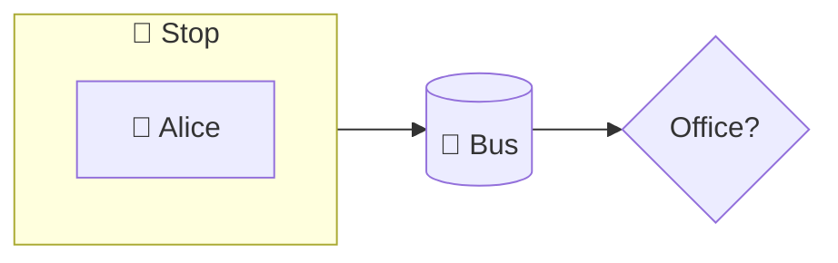

# Writing a codecast (for agents and humans)

A **codecast** is a short spoken tour of a Rust project. The IwannatRust player performs it on top of
its views: switching diagrams, glowing the block being talked about, underlining code. Input: the
**brief** (`iwr brief <path>`). Output: a **script** in the markdown format below, as one `codecast.md`
or a `codecast/` directory (`index.md` with title + part list, one `NN-part-name.md` per part, optional
`glossary.md`). Validate with `iwr check <script> --path <path>`, hear-check with `iwr speak <script>`.

## Format

```
# <Title>

## <Part name>               one subject, 4–10 cues, playable alone
plan: <one line about it>    optional: its line on the plan page (or write it after the link in index.md)
@ <view>[:<ref>]             what to show (sticky until the next @); `@ plan` shows the plan page
! <ref> [<ref> …]            what to glow (sticky; `!` alone clears)
= <file>:<line>:<c1>-<c2>    what to underline in the code (this cue only)
> <node> [<group|node>]      diagrams only: move a node from this cue on (sticky in the part)
> +<node> -<node>            diagrams only: show a `:::hidden` node / hide one
<One or two spoken sentences.>
? <A question the listener may have>      optional, after the cue it belongs to
  <The answer, indented, two to four sentences; may start with its own @ ! = lines>
```

Views: `code` `calls` `flow` `arch` `branches` `structure` `types` `errors`, and `diagram` (below).
Refs: `crate::run` (item) · `crate::run/b5` (block 5 of `run`, ids as in the brief) · `crate::storage`
(module) · `src/parser.rs` (file; `@ code:src/parser.rs` opens it) · `src/main.rs:49-52` (lines) ·
`src/main.rs:49:17-44` (columns, 1-based, `c2` inclusive). `crate::` may be omitted when the name
is unique. `//` starts a comment line.

| Subject | `@` | Good `!` targets |
|---------|-----|------------------|
| big picture, modules, dependencies | `arch` | module refs |
| data model, traits, who implements what | `types[:module]` | struct / enum / trait refs |
| what one function does, step by step | `flow:fn` | `fn/bN` blocks |
| the same, reading like code | `code:fn` | `fn/bN` blocks (parents open automatically) |
| who calls whom from an entry point | `calls:fn` | fn refs |
| all the paths through a function | `branches:fn` | `fn/bN` blocks |
| where errors come from and go | `errors[:module]` | fn and error-enum refs |
| files and impl blocks at a glance | `structure[:module]` | item refs |
| a tour of the files | `code:<file>` per cue | item refs in that file |

## How to write it

1. **A tour, not a list of facts.** The script plays in a row: a *Welcome* part saying what the
   project is for and where we will go (put `@ plan` on that cue: the player shows the parts as a
   list, so give each one a line after its link in `index.md`), parts that follow from each other,
   a one-sentence wrap-up.
2. **Parts are subjects**, with titles a listener would pick from a menu (*How a request flows*,
   *Where errors go*, *The scheduler*), 4–12 of them. First the big picture, then deeper; for a
   listener new to Rust, one part on the language mechanism the code shows best (ownership, traits).
3. **One view per part.** Ten cues on one function, moving only the glow, beat jumping between views.
   Change `@` only when the subject really moves, two or three times per part at most.
4. **Link the parts.** End each with a hand-over ("Next, let's see what executing a task means."),
   begin the next by picking it up. The listener should never wonder why the view changed.
5. **One idea per cue**, one or two sentences, ≤ 30 words each (the listener sees the caption).
   Connect cues naturally: *First, … Then … Notice … Otherwise … Finally …*
6. **Point at code**: `=` on the exact token you are talking about (the `?`, the `.await`, a
   condition). At least one per part that walks through code.
7. **Say what it does and why**, not what it is called: "The scheduler picks the heaviest task
   each round" beats "`next_task` returns an `Option<Task>`".
8. **Name the Rust mechanism** the reader may not know (`?` propagation, trait dispatch, ownership
   moves, recursion base case), one sentence, in place. Use the real words (crate, impl, trait,
   closure…): the player's glossary then offers a "What is a …?" question by itself.
9. **Add your own `?`** when the answer is specific to this project ("Why does deploy never run?"),
   one or two per part, with an answer of two to four sentences readable aloud. Recurring project
   vocabulary goes in `codecast/glossary.md`, not repeated in cues.
10. **Every ref must exist**: ids from the brief, never invented line numbers. Prefer block refs
    (`fn/bN`) over line refs; they survive edits.
11. **Write code as code**: `parse_all`, `Task::weight`, `&tasks`, `Option<Task>` are spoken as
    "parse all", "Task weight", "a reference to tasks", "Option of Task", and the caption shows the
    real token. Never spell for the voice ("parse underscore all"). Backticks are optional for single
    names, useful for expressions. Fix a word the voice gets wrong with `pronounce: written = spoken`
    in the header.
12. **Be a host, not a textbook.** A light touch of humour tied to the code keeps a listener awake:
    short, kind, and no puns that need spelling.

## Diagrams (when the code has no picture)

For a metaphor, a physical effect, a protocol or any schema that is not in the code, draw it: a
```` ```mermaid ```` flowchart block in the part, `@ diagram` to show it, `!` with node ids to glow.
Shapes set the colour: `[box]` blue · `(round)` green · `([pill])` purple · `{diamond}` yellow ·
`[(store)]` teal; `subgraph id[Title] … end` draws a group. Emoji in labels are fine (`b[🚌 Bus]`).
To show something flowing (a request through layers, a value changing owner), move a node:
`> alice bus` puts it into group `bus` (or next to node `bus`) from that cue on, `> alice` brings
it back to the top; one move per line, undone when the listener steps back. A node written
`copy[📄 copy]:::hidden` waits until `> +copy` draws it (`> -copy` hides it again), so one block
can hold the whole story and reveal it cue by cue. Keep 3–8 nodes, one block per part, and come
back to the code afterwards.

````
## Why tasks queue up

@ diagram
! stop
Think of tasks as passengers waiting at a stop.
> alice bus
! bus
Alice boards: the scheduler took the heaviest task first.
````

## Example

```
# A tour of the demo task runner

## Welcome
@ arch
Welcome to the demo task runner. It reads a list of tasks from text, stores them, and runs them in priority order.
! crate::parser
The parser turns text lines into tasks. It is the first thing the program touches, and the first place things can go wrong.
!
That is the whole map. Now let's follow the program as it runs.

## How a run works
@ flow:crate::run
Everything starts in main, which only calls run. So run is where the story is, and we will stay here for a while.
! crate::run/b1
= src/main.rs:49:41-41
First, run hands the input to the parser. Notice the question mark: if parsing fails, run stops right here and gives the error to main.
? What is run's return type?
  = src/main.rs:48:24-46
  A Result of usize and AppError: Ok with the number of tasks that ran, or Err with what went wrong. Rust has no exceptions, so a function that can fail says so in its signature.
! crate::run/b5 crate::run/b6
= src/main.rs:55:22-30
Then every parsed task is saved into storage, one per loop iteration. `t.clone()` makes a copy, because the storage wants to own its task and the loop only borrowed it.
```

## Checklist

- `iwr check` prints "all refs resolve"; every `?` has an indented answer.
- Directory form: `index.md` has `# Title` and a `- [Part](NN-file.md)` list in playing order; each
  part file starts with its `## Part name`.
- First part welcomes and says what the project is for; last cue wraps up; each part hands over.
- First cue of every part sets `@`; no part longer than twelve cues.
- `iwr speak` reads well: no "underscore", no "colon colon"; odd words have a `pronounce:` line.
