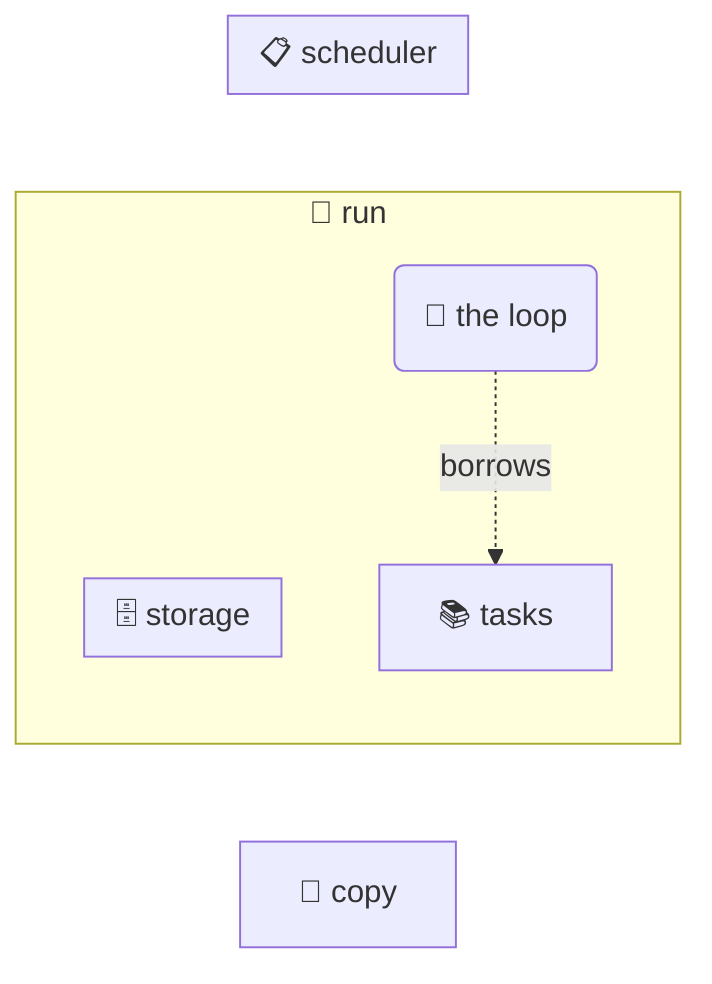

## Ownership in sixty seconds

@ diagram
! run
Before the code, a picture. Think of run as a person holding things: a list of tasks and an empty storage box. Everything inside this frame belongs to run.
! loop tasks
First, borrowing. The loop only looks at the list: a dotted line, nothing changes hands. When the loop ends, the list is still in run's hands.
> +copy
> copy storage
! copy
Second, cloning. Each task is photocopied, and the copy goes into the storage. Two owners, two copies, no fight.
> storage scheduler
! scheduler
Third, moving. run hands the whole storage over to the scheduler. After that line, run cannot touch the storage any more: the compiler treats it as gone.
Now the same three things, in the code.
@ code:crate::run
Rust has no garbage collector and no manual free. Instead every value has exactly one owner, and when the owner goes out of scope the value is cleaned up. The compiler keeps the books, and run shows all three ways of dealing with it.
! crate::run/b5
= src/main.rs:54:14-19
First, borrowing. `for t in &tasks` walks the list without taking it. The ampersand means "lend me a look", and tasks is still there, fully owned by run, after the loop. If the code said `for t in tasks`, the list would be consumed by the loop and gone.
! crate::run/b6
= src/main.rs:55:22-30
Second, cloning. Each t is only a borrowed peek at a task, but storage.save wants a task to keep, forever. So the code makes a copy with clone, and the storage owns the copy. Rust makes you write clone on purpose: a copy costs memory, so it should be visible.
? Could we avoid the clone?
  Yes: `for t in tasks` would hand each task to the loop by value, and `storage.save(t)` would move it straight into the storage, no copy. The demo keeps the borrow and the clone so you can see both forms, and because tasks is not used again, both versions compile. In real code you pick the move, unless you still need the list afterwards.
! crate::run/b7
= src/main.rs:57:36-42
Third, moving. `Scheduler::new(storage)` hands the storage over, no ampersand, no clone. After this line run cannot touch storage any more; the scheduler owns it. Try to use it and the compiler stops you with a message that starts with "value used after move". That compiler is the bouncer at the door of every function, and it has read your ID.
! crate::run/b12
= src/main.rs:63:17-21
And once more a borrow: `execute(&task, 0)`. Execute only needs to read the task, so it gets a reference, and run keeps the task itself. Lend when reading, clone when you need a copy, move when you are done with it. That is ownership, and the sixty seconds are up.
? What does the borrow checker actually check?
  Two rules. At any moment a value can have any number of readers, or exactly one writer, but never both. And no reference may outlive the value it points to. Everything else, the lifetimes, the error messages, the memes, is downstream of those two rules. They are what let Rust promise no data races and no dangling pointers without a garbage collector.
